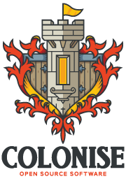

# CHANGEME

      

> TODO

### Overview

TODO

### Documentation

Full documentation can be found under [documentation](documentation), or by looking for the identically named Markdown file adjacent to each source file.

### Want to contribute?

That's great! We'd love to see what suggestions you have.

[Read the contributing guide.](CONTRIBUTING.md)

### Open Source

CHANGEME is part of the Colonise Open Source Software, and is made with love by the Colonise team.

### [License](LICENSE)

